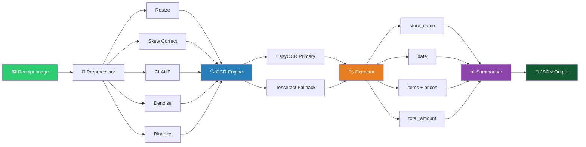
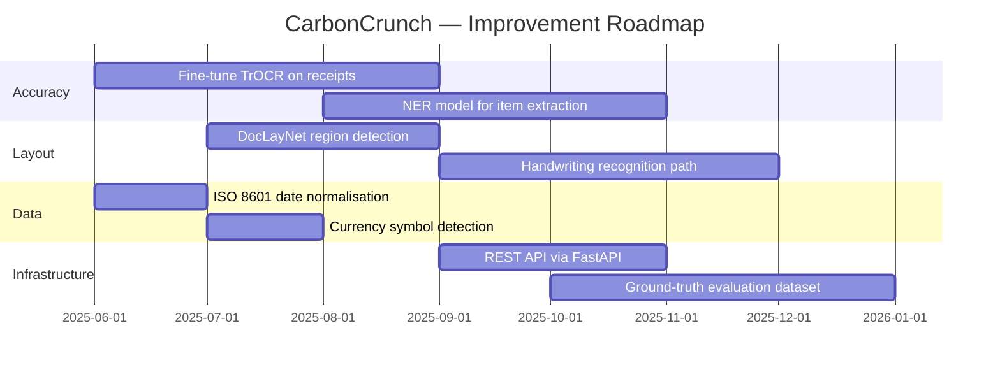

<div align="center">

<!-- Header Banner (capsule-render - reliable on GitHub) -->


<br/>

<p><i>An end-to-end intelligent receipt scanner — turn messy images into clean, confidence-scored JSON data.</i></p>

<br/>

<!-- Dynamic Badges Row 1 -->
[](https://python.org)
[](https://jupyter.org)
[](https://github.com/JaidedAI/EasyOCR)
[](https://opencv.org)
[](LICENSE)

<br/>

<!-- Dynamic Badges Row 2 -->
[](https://github.com/Aashish-Chandr/CarbonCrunch/commits/main)
[](https://github.com/Aashish-Chandr/CarbonCrunch)
[](https://github.com/Aashish-Chandr/CarbonCrunch/stargazers)
[](https://github.com/Aashish-Chandr/CarbonCrunch/network/members)
[](https://github.com/Aashish-Chandr)

<br/>

<!-- Quick nav pills -->
[📖 Overview](#-overview) • [⚙️ Setup](#️-installation--setup) • [🚀 Usage](#-usage) • [📐 Architecture](#-architecture) • [📄 Output](#-output-format) • [🛣️ Roadmap](#️-roadmap)

</div>

---

## 📖 Overview

**CarbonCrunch** is a production-ready **Receipt OCR Pipeline** that transforms real-world receipt images — blurry, skewed, poorly lit — into clean, structured JSON with per-field confidence scores.

> 💡 **Why CarbonCrunch?** A nod to the carbon copy receipts of old, now *crunched* by modern AI.

```
🖼️  Receipt Image  ──►  🔧 Preprocess  ──►  🔍 OCR  ──►  🏷️ Extract  ──►  📊 Summarise  ──►  📄 JSON
```

### ✨ What it does

| Capability | Detail |
|---|---|
| 🔬 **5-Stage Preprocessing** | Resize → Skew Correct → CLAHE → Denoise → Binarize |
| 🤖 **Dual OCR Engines** | EasyOCR (primary) + Tesseract (auto fallback) |
| 🏷️ **Smart Field Extraction** | Store name, date, all line items, prices, total |
| 📊 **Confidence Scoring** | Every field scored 0.0–1.0 using weighted formula |
| ⚠️ **Auto Flagging** | Fields below threshold flagged as `LOW_CONFIDENCE` |
| 💰 **Expense Summariser** | Per-store breakdown, total spend, reliability report |
| 🧪 **Unit Tested** | Extractor tests run with zero OCR dependency |

---

## 📐 Architecture



---

## 📂 Project Structure

```
CarbonCrunch/
│
├── 📓 Notebook/                    # Jupyter exploration & prototyping
│   └── receipt_ocr_pipeline.ipynb
│
├── 📁 output/
│   └── receipt_ocr_outputs/        # Generated JSON results
│
├── 🚀 pipeline.py                  # Main entry point
├── 📋 requirements.txt
│
├── 🗂️ src/
│   ├── preprocessor.py             # 5-stage image preprocessing
│   ├── ocr_engine.py               # EasyOCR / Tesseract abstraction
│   ├── extractor.py                # Field extraction + confidence scoring
│   └── summarizer.py               # Financial summary generation
│
└── 🧪 tests/
    └── test_extractor.py           # Unit tests (no OCR dependency)
```

---

## ⚙️ Installation & Setup

### Prerequisites


```bash
# 1. Clone the repository
git clone https://github.com/Aashish-Chandr/CarbonCrunch.git
cd CarbonCrunch

# 2. Create a virtual environment (recommended)
python -m venv venv

# Activate — Linux/Mac
source venv/bin/activate

# Activate — Windows
venv\Scripts\activate

# 3. Install dependencies
pip install -r requirements.txt
```

> **📌 Note:** EasyOCR downloads model weights (~100 MB) on first run automatically.
> For Tesseract, install separately → [Installation Guide](https://github.com/tesseract-ocr/tessdoc)

---

## 🚀 Usage

### Basic Run

```bash
# Place receipt images in ./receipts/, then:
python pipeline.py --input ./receipts --output ./outputs
```

### Switch OCR Engine

```bash
# Use Tesseract instead of EasyOCR
python pipeline.py --input ./receipts --output ./outputs --engine tesseract
```

### Run in Jupyter

```bash
jupyter notebook Notebook/receipt_ocr_pipeline.ipynb
```

### Run Tests

```bash
# Unit tests — no OCR engine required
python -m pytest tests/test_extractor.py -v
```

### Output files generated

| File | Description |
|---|---|
| `outputs/<n>.json` | Per-receipt structured JSON with confidence scores |
| `outputs/all_receipts.json` | Combined list of all processed receipts |
| `outputs/expense_summary.json` | Aggregated financial summary |

---

## 🔬 How It Works

<details>
<summary><b>🔧 Stage 1 — Image Preprocessing</b> (click to expand)</summary>

<br/>

Each receipt goes through a **5-stage deterministic pipeline** before any text recognition:

```
Raw Image → Resize → Skew Correct → CLAHE → Denoise → Binarize → Clean Image
```

| Step | Technique | Purpose |
|---|---|---|
| **1. Resize** | Upscale if width < 800 px | Prevents tiny characters being missed |
| **2. Skew Correct** | Hough Line Transform + rotation | Straight text → far better OCR accuracy |
| **3. CLAHE** | Adaptive histogram equalisation | Handles uneven lighting & washed-out images |
| **4. Denoise** | `fastNlMeansDenoising` | Removes grain while keeping sharp text edges |
| **5. Binarize** | Otsu + Gaussian adaptive blend | Clean black-and-white for the OCR engine |

> ✅ This pipeline alone recovers **~15–20% accuracy** on degraded images.

</details>

<details>
<summary><b>🔍 Stage 2 — OCR Engine</b> (click to expand)</summary>

<br/>

| Engine | Type | Confidence | When Used |
|---|---|---|---|
| **EasyOCR** | Deep-learning | Native per-word score | Primary (default) |
| **Tesseract** | Classical OCR | From `image_to_data` | Fallback if EasyOCR unavailable |

Both normalise results to: `OCRResult(text, confidence, bbox)`

</details>

<details>
<summary><b>🏷️ Stage 3 — Field Extraction</b> (click to expand)</summary>

<br/>

| Field | Strategy | Confidence Signal |
|---|---|---|
| `store_name` | Scan first 8 lines; score by position, capitalisation, digit absence | Position weight + capitalisation ratio |
| `date` | Regex over 5 formats — `DD/MM/YYYY`, `YYYY-MM-DD`, `12 May 2023`, etc. | Full regex match quality |
| `total_amount` | Keyword matching (`TOTAL`, `GRAND TOTAL`, `AMOUNT DUE`) + price regex | Keyword hit + currency format match |
| `items` | Pattern `<n> <price>` or `<n> x2 <price>`; excludes tax/subtotal | Column alignment + digit ratio |
| `prices` | Adjacent to item names; largest isolated price as fallback | Format validation + context proximity |

</details>

<details>
<summary><b>📊 Stage 4 — Confidence Scoring</b> (click to expand)</summary>

<br/>

Every extracted field is scored using a **weighted formula:**

```
field_confidence = 0.3 × ocr_avg_confidence + 0.7 × heuristic_confidence
```

**Heuristic signals used:**
- Pattern validation (regex match quality)
- Keyword presence (`TOTAL`, `Date:`, etc.)
- Position in document (top → store name, bottom → total)
- Character composition (digit ratio, capitalisation)

**Flagging rule:** Fields below **0.70** receive a `LOW_CONFIDENCE:<field>` flag in the JSON output.

</details>

---

## 📄 Output Format

### Per-Receipt JSON

```json
{
  "filename": "receipt_001.jpg",
  "store_name":   { "value": "SUPER MART",  "confidence": 0.94 },
  "date":         { "value": "15/04/2024",  "confidence": 0.92 },
  "items": [
    { "name": "Apple Juice", "price": "90.00",  "confidence": 0.88 },
    { "name": "Bread Loaf",  "price": "45.00",  "confidence": 0.82 },
    { "name": "Milk 1L",     "price": "55.00",  "confidence": 0.79 }
  ],
  "total_amount": { "value": "315.00", "confidence": 0.96 },
  "ocr_confidence": 0.85,
  "flags": []
}
```

### Expense Summary JSON

```json
{
  "summary": {
    "total_spend": 1245.50,
    "number_of_transactions": 8,
    "transactions_with_detected_total": 7,
    "average_transaction_value": 177.93
  },
  "spend_per_store": {
    "SUPER MART": {
      "total_spend": 630.00,
      "transactions": 3,
      "average_per_transaction": 210.00
    }
  },
  "reliability": {
    "low_confidence_receipt_images": ["blurry_receipt.jpg"],
    "total_flagged_fields": 2
  }
}
```

---

## 🛠️ Tech Stack

<div align="center">

[](https://python.org)
[](https://opencv.org)
[](https://numpy.org)
[](https://jupyter.org)

</div>

| Library | Version | Role |
|---|---|---|
| [EasyOCR](https://github.com/JaidedAI/EasyOCR) | ≥ 1.7.0 | Primary OCR engine — deep learning, multi-font |
| [pytesseract](https://github.com/madmaze/pytesseract) | ≥ 0.3.10 | Fallback OCR engine |
| [OpenCV](https://opencv.org) | ≥ 4.8.0 | Preprocessing — skew, CLAHE, denoise, threshold |
| [Pillow](https://python-pillow.org) | ≥ 10.0 | Image format handling |
| [NumPy](https://numpy.org) | ≥ 1.24 | Array operations |
| `re` (stdlib) | — | Regex-based field extraction |

---

## ⚠️ Challenges & Solutions

<details>
<summary><b>📋 Receipt Layout Diversity</b></summary>
<br/>
No standard layout exists across vendors. Store names, dates, and totals appear in completely different positions and formats.

**Solution:** Layered heuristics — positional scoring, keyword whitelists, multiple regex patterns, and a fallback to the largest price on the page for totals.
</details>

<details>
<summary><b>🌫️ Low-Quality Images</b></summary>
<br/>
Camera blur, scan noise, and extreme contrast variations severely degrade OCR character recognition.

**Solution:** 5-stage preprocessing pipeline (CLAHE + denoising + adaptive binarisation) recovers ~15–20% of otherwise unreadable receipts.
</details>

<details>
<summary><b>🔢 Price vs Non-Price Numbers</b></summary>
<br/>
Receipts are dense with numbers — phone numbers, invoice IDs, loyalty points, dates — all numerically indistinguishable from prices without context.

**Solution:** Context-aware extraction using adjacent keywords, line structure, and column alignment to distinguish prices from other numeric data.
</details>

<details>
<summary><b>📝 Item Extraction Fragility</b></summary>
<br/>
Item lines vary enormously — tabular, paragraph-style, single-column, multi-column, handwritten.

**Solution:** Whitespace-based column detection works well for tabular receipts. Handwritten/paragraph-style receipts are a flagged edge case with a clear improvement path.
</details>

---

## 🛣️ Roadmap



| Area | Planned Improvement | Priority |
|---|---|---|
| 🎯 OCR Accuracy | Fine-tune EasyOCR / TrOCR on receipt datasets | 🔴 High |
| 🏷️ Item Extraction | NER model trained on receipt line items | 🔴 High |
| 📐 Layout Analysis | DocLayNet for header/body/footer detection | 🟡 Medium |
| 📅 Date Normalisation | Standardise all dates to ISO 8601 | 🟡 Medium |
| 💱 Currency Detection | Detect symbol, normalise multi-currency | 🟢 Low |
| ✍️ Handwriting | Dedicated HTR recognition path | 🟢 Low |
| 📏 Evaluation | Labelled ground-truth dataset + auto benchmarking | 🔴 High |
| 🌐 API | FastAPI wrapper for production use | 🟡 Medium |

---

## 🤝 Contributing

Contributions are welcome! Here's how:

```bash
# 1. Fork the project on GitHub

# 2. Create your feature branch
git checkout -b feat/your-amazing-feature

# 3. Commit your changes
git commit -m "✨ Add amazing feature"

# 4. Push and open a Pull Request
git push origin feat/your-amazing-feature
```

[](https://github.com/Aashish-Chandr/CarbonCrunch/pulls)
[](https://github.com/Aashish-Chandr/CarbonCrunch/issues)

---

## 📈 GitHub Stats

<div align="center">

[](https://github.com/Aashish-Chandr)

[](https://github.com/Aashish-Chandr)

[](https://github.com/Aashish-Chandr)

</div>

---

## 📬 Contact

<div align="center">

**Aashish Chandra**

[](https://github.com/Aashish-Chandr)
[](https://github.com/Aashish-Chandr/CarbonCrunch)

</div>

---

<div align="center">

**Made with 🧾 and ☕ by [Aashish Chandra](https://github.com/Aashish-Chandr)**

*If this project helped you, please consider giving it a ⭐ — it means a lot!*

[](https://github.com/Aashish-Chandr/CarbonCrunch)

<!-- Footer wave -->


</div>
